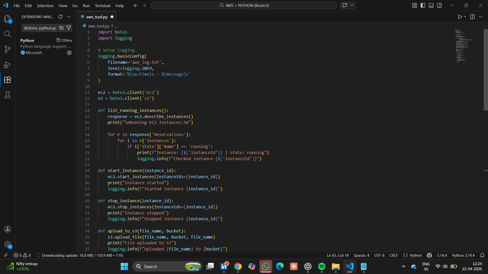
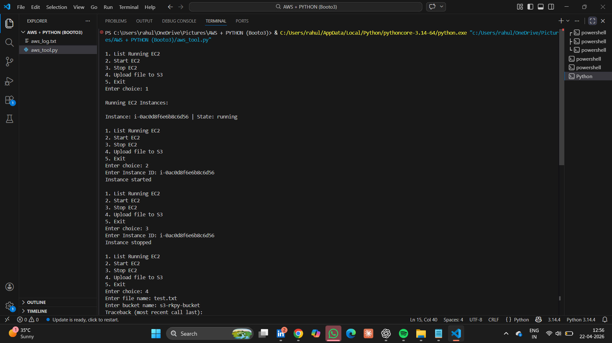
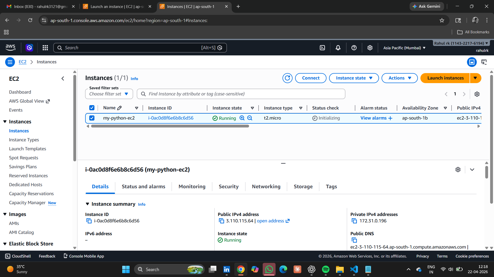
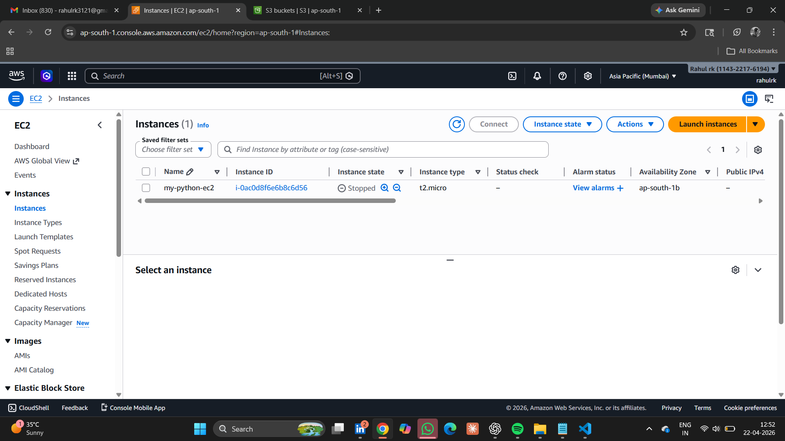
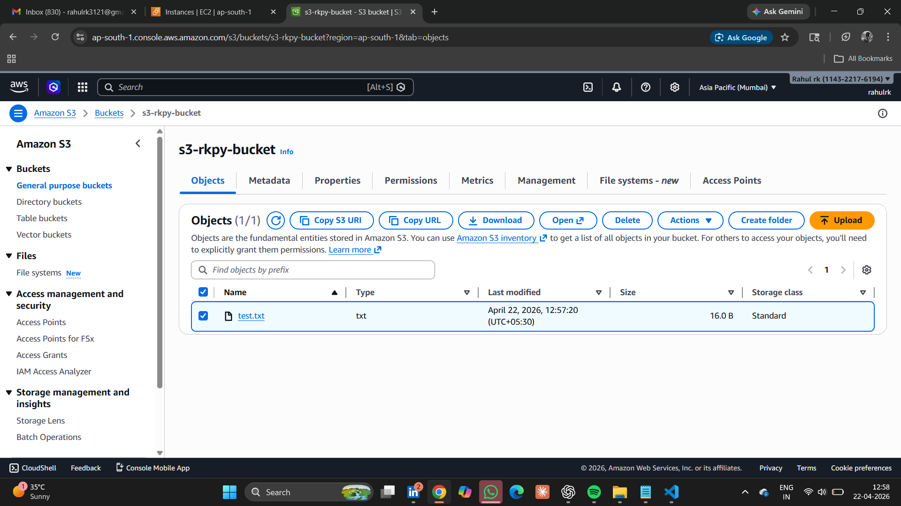

# 🚀 AWS Automation using Python (Boto3)

This repository showcases my hands-on learning in automating AWS services using Python and the Boto3 SDK.

---

## 📌 Overview

This implementation focuses on automating common AWS operations such as managing EC2 instances and uploading files to Amazon S3.  
It demonstrates how cloud tasks can be simplified using Python-based automation.

---

## 🔧 Features

- List running EC2 instances  
- Start EC2 instances  
- Stop EC2 instances  
- Upload files to Amazon S3  
- Logging for tracking and monitoring actions  

---

## 🛠️ Tech Stack

- Python  
- Boto3 (AWS SDK for Python)  
- AWS EC2  
- AWS S3  

---

## ▶️ How to Run

### 1. Install dependencies
```bash
pip install boto3 awscli
```

### 2. Configure AWS
```bash
aws configure
```

### 3. Run the script
```bash
python aws_tool.py
```

---

## 📸 Screenshots

### 🖥️ Python Script


---

### 💻 Terminal Execution


---

### ☁️ EC2 Instance (Running)


---

### 🔄 EC2 Instance (Stopped)


---

### 📦 S3 File Upload


---

## 🧠 Learning Outcome

- Gained hands-on experience with AWS automation using Python  
- Understood EC2 instance lifecycle management  
- Learned how to integrate S3 operations programmatically  
- Implemented logging for monitoring and debugging  

---

## 📌 Note

This is part of my continuous learning in Cloud and DevOps.

---

## 📫 Connect with me

- LinkedIn: www.linkedin.com/in/rk-cloud-devops
